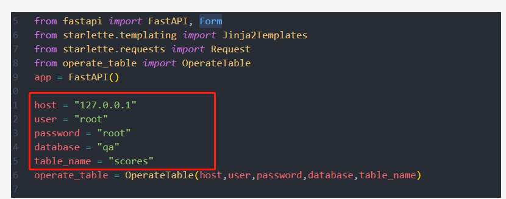

# Readme

## 需要安装的库

```
pip install fastapi
pip install "uvicorn[standard]"
pip install PyMySQL
pip install python-multipart
```

## 解释


operate_table.py为操作数据库的代码，insert方法可以写入id和score到数据库，getHighScoreData可以获取排名前几的id和分数,*data_num*参数指定获取多少

## 程序启动

前端页面放templates文件夹下

需要先更改数据库的相关信息，在main.py中




前端可以通过post的方式访问save_score和best_score方法用于保存数据和获取排名前几的数据

配置完成后运行main.py文件

```

```

